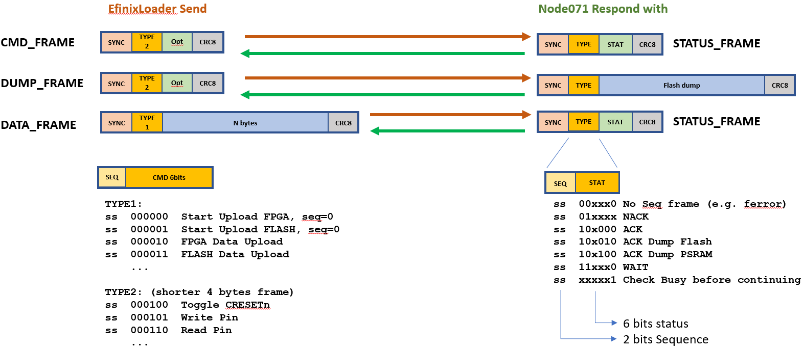

# Efinix T20Q100 Bitstream Loader
## Simple Serial Loader

 
# 1. Introduction

The EfinixLoader is a simple serial loader which takes an Efinity produced hex file and uploads it to the T20Q100F3 via a UART to SPI bridge. This bridge is implemented on the on-board STM32C071 microcontroller. 

The loader is written in plain C and should be easily portable to Linux/MacOS, you just need to replace the serial port routines. The supplied version is for Windows and is compiled with gcc for Windows.

13-Jul-2025 Note this code and associated STM32C071 code is still work in progress.

```
h:\GitHub\Efinix_T20_Dev_Board\EfinixLoader>EfinixLoader.exe -?

**************************************************
***        Efinix SPI FPGA Hex loader          ***
***         Ver 0.2 (c)2025 HT-LAB             ***
*** github.com/htminuslab/Efinix_T20_Dev_Board ***
**************************************************

Usage                : EfinixLoader <options> fpgafile.hex

Options:
-q                   : quiet, must be specified first in the options list
-com portnumber      : Comport, 1.. default to "\\.\COM7"
-baud int            : Baudrate, default is 921600
-flash               : Write bitstream to FLASH memory, default to RAM
-readflash           : Read 256 bytes from flash
-readpsram           : Read 256 bytes from psram
-chiperase           : Erase Flash
-resetaddr           : Reset 24bits flash/psram address pointer to 0
-nextpage            : Increase address pointer by 256
-nextsector          : Increase address pointer by 4096
-next64k             : Increase address pointer by 65536
-fpgabaudrate        : Set the baudrate between STM32 and FPGA, default is 115200
-status              : Read Status byte
-reset               : Toggle FPGA CRESET line
-setpina n 0/1       : Set PortA pin n to 0 or 1
-setpinb n 0/1       : Set PortB pin n to 0 or 1
-setpinc n 0/1       : Set PortC pin n to 0 or 1
-setdira n 0/1       : Set PortA pin n to direction 0=output or 1=input, no pull-up or down
-setdirb n 0/1       : Set PortB pin n to direction 0=output or 1=input, no pull-up or down
-setdirc n 0/1       : Set PortC pin n to direction 0=output or 1=input, no pull-up or down
-setpulla n 0/1      : Set PortA pin n resistor to 0=pull-down or 1=pull-up
-setpullb n 0/1      : Set PortB pin n resistor to 0=pull-down or 1=pull-up
-setpullc n 0/1      : Set PortC pin n resistor to 0=pull-down or 1=pull-up
-setalta n           : Set PortA pin n to alternate(peripheral) function
-setaltb n           : Set PortB pin n to alternate(peripheral) function
-setaltc n           : Set PortC pin n to alternate(peripheral) function
-readporta           : Read PortA
-readportb           : Read PortB
-readportc           : Read PortC

                     : press ESC to quit
```					 

# 2. Upload a hex file

To upload a hex file simply specify the filename as shown below (adjust the comport as required):

```
H:\GitHub\Efinix_T20_Dev_Board\EfinityLoader>EfinixLoader.exe -com 7 ..\Examples\blink_led\blink_led.hex

**************************************************
***        Efinix SPI FPGA Hex loader          ***
***         Ver 0.2 (c)2025 HT-LAB             ***
*** github.com/htminuslab/Efinix_T20_Dev_Board ***
**************************************************

Comport            : \\.\COM7 921600,N,8,1
Reading Hex file   : ..\Examples\blink_led\blink_led.hex
Upload to          : FPGA RAM
File size is       : 2035950 bytes

Uploading(0,0) 100.0%

Done
```
Uploading takes about a minute but there are some way to speed this up significantly. If you look at the hex file most bytes are zero so it shouldn't be too difficult to compress. 

## 2.1 Upload to Flash

The T20Q100F3 has 16Mbit of internal flash, to upload to flash memory and make the design start during power up use the **-flash** argument when uploading the hex file. Before issuing the **-flash** load command clear the flash using the **-chiperase** option, example:

```
h:\GitHub\Efinix_T20_Dev_Board\EfinixLoader>EfinixLoader.exe -q -chiperase 
```

Next upload the new flash image:

```
h:\GitHub\Efinix_T20_Dev_Board\EfinixLoader>EfinixLoader.exe -flash ..\Examples\blink_led\blink_led.hex

**************************************************
***        Efinix SPI FPGA Hex loader          ***
***         Ver 0.2 (c)2025 HT-LAB             ***
*** github.com/htminuslab/Efinix_T20_Dev_Board ***
**************************************************

Comport            : \\.\COM7 921600,N,8,1
Reading Hex file   : ..\Examples\blink_led\blink_led.hex
Upload to          : FPGA Flash
File size is       : 2035950 bytes

Total 42416 frames send

Done.
```
After the image has been upload the efinixloader will issue a **-reset** command which loads the image from flash to ram and start it.

## 2.2 Upload to PSRAM

If the PSRAM is fitted you can upload to it as well although you cannot execute from it. Simply use the -psram option when uploading a file. The data is then available for whatever IP core is uploaded.


## 2.3 Read Flash memory

The flash can be read using the **-readflash** command. First issue the **-resetaddr** commands which resets an internal flash read memory pointer. If you now issue the **-readflash** command you will read the first 256 bytes (address pointer is 0x000000):

```
h:\GitHub\Efinix_T20_Dev_Board\EfinixLoader>EfinixLoader.exe -resetaddr -q
```

Address pointer is now 0x000000.

```
h:\GitHub\Efinix_T20_Dev_Board\EfinixLoader>EfinixLoader.exe -readflash -q

00: 56 65 72 73 69 6f 6e 3a 20 32 30 32 35 2e 31 2e
10: 31 31 30 2e 31 2e 35 0a 47 65 6e 65 72 61 74 65
20: 64 3a 20 53 61 74 20 4a 75 6e 20 32 38 20 30 39
30: 3a 31 38 3a 35 31 20 32 30 32 35 0a 0a 50 72 6f
40: 6a 65 63 74 3a 20 48 3a 5c 47 69 74 48 75 62 5c
50: 45 66 69 6e 69 78 5f 54 32 30 5f 44 65 76 5f 42
60: 6f 61 72 64 5c 45 78 61 6d 70 6c 65 73 5c 62 6c
70: 69 6e 6b 5f 6c 65 64 0a 46 61 6d 69 6c 79 3a 20
80: 54 72 69 6f 6e 0a 44 65 76 69 63 65 3a 20 54 32
90: 30 51 31 30 30 46 33 0a 57 69 64 74 68 3a 20 31
a0: 0a 4d 6f 64 65 3a 20 70 61 73 73 69 76 65 0a 50
b0: 41 44 44 45 44 5f 42 49 54 53 3a 20 30 0a 0a 0a
c0: 0a 0a 0a 0a 0a 0a 0a 0a 0a 0a 0a 0a 0a 0a 0a 0a
d0: 0a 0a 0a 0a 0a 0a 0a 0a 0a 0a 0a 0a 0a 0a 0a 0a
e0: 0a 0a 0a 0a 0a 0a 0a 0a 0a 0a 0a 0a 0a 0a 0a 0a
f0: 0a 0a 0a 0a 0a 0a 0a 0a 0a 0a 0a 0a 0a 0a 0a 0a
```

After each **-readflash** command the address is automatically updated to the next sector(+256), the address pointer is now 0x000100.

```
h:\GitHub\Efinix_T20_Dev_Board\EfinixLoader>EfinixLoader.exe -readflash -q

00: 16 8a 22 36 ff f2 94 36 46 0e 30 e0 00 00 00 00
10: 00 00 00 00 00 00 00 00 00 00 00 00 00 00 00 00
20: 00 00 00 00 00 00 00 00 00 00 00 00 00 00 00 00
30: 00 00 00 00 00 00 00 00 00 00 00 00 00 00 00 00
40: 00 01 00 01 00 00 00 01 00 00 00 00 00 00 00 00
50: 00 20 08 c4 10 18 00 90 00 52 cf b0 00 63 14 00
60: 06 33 60 00 63 14 00 06 31 40 00 6b 1f 00 06 31
70: 40 00 63 14 00 06 33 60 00 63 14 00 06 31 40 00
80: 63 14 00 06 31 40 00 63 14 00 31 8a 00 03 18 a0
90: 00 31 8a 00 03 18 a0 00 31 8a 00 03 18 a0 00 31
a0: 8a 00 03 18 a0 00 31 8a 00 03 18 a0 00 31 8a 00
b0: 03 18 a0 00 31 8a 00 03 18 a0 00 00 00 00 00 00
c0: 00 00 00 10 22 00 6a c8 d5 91 ab 23 56 46 ac 8d
d0: 59 1a b2 35 64 6a c8 d5 91 ab 23 56 46 ac 8d 59
e0: 1a b2 35 64 6a c8 d5 91 ab 23 56 46 ac 8d 59 1a
f0: b2 35 64 6a c8 d5 91 ab 23 56 46 ac 8d 59 1a b2

```
Address pointer is now 0x000200.

To reach a particular sector you can increase the memory pointer by 1 page (256 Bytes), one sector (4096 bytes) or 1 block (64Kbyte). This can be automated in the Efinixloader program (not yet done).

```
-resetaddr           : Reset 24bits flash/psram address pointer to 0
-nextpage            : Increase address pointer by 256
-nextsector          : Increase address pointer by 4096
-next64k             : Increase address pointer by 65536
```

## 2.4 Read PSRAM memory

As with the Flash memory the PSRAM can be read using the **-readpsram** argument. The Address pointer is shared with the Flash command. Thus if
 you read a Flash or PSRAM sector the pointer is updated. 


# 3. Check FPGA status

The -status arguments reads the CDONE and NSTATUS pins which indicates the state of the T20Q100F3:

| CDONE | NSTATUS | Status    |
|-------|---------|-----------|
| 0 | 0 | Status | Failed to Configure |
| 0 | 1 | Programming |
| 1 | 0 | Failure Mode |
| 1 | 1 | FPGA in User Mode |

See the T20 Datasheet for more info on these states.

```
H:\GitHub\Efinix_T20_Dev_Board\EfinityLoader>EfinixLoader.exe -status

**************************************************
***        Efinix SPI FPGA Hex loader          ***
***         Ver 0.2 (c)2025 HT-LAB             ***
*** github.com/htminuslab/Efinix_T20_Dev_Board ***
**************************************************

Comport            : \\.\COM7 921600,N,8,1
CDONE=1 NSTATUS=1  >> FPGA in User Mode <<

Done
```

# 2. Toggle CRESET_N pin 

The CRESET_N pin can be toggled (Low->High) using the **-reset** command. By default the microcontroller sets the SS_N signal to input with a weak pull-up. This means that when the CRESET_N signal is toggled the Active Mode is activated and the T20Q100F3 tries to load a design from the internal flash memory. 

```
H:\GitHub\Efinix_T20_Dev_Board\EfinityLoader>EfinixLoader.exe -reset -q
Toggle Reset, CDONE=1 NSTATUS=1  >> FPGA in User Mode <<
```

# 3. Change Pin assignment

All user I/O pins on the STM32C071 are set to input with a weak pull-up after reset. Exceptions are the CLK48M and CRESET_N pins. The Single Wire debug (SWCLK,SWDIO) and USB pins (USB_DP/USB_DM) can also not be changed.

Changing a user Pin on the STM32C071 takes 2/3 commands. 

The first command is to set the pin direction, use 0 for Output and 1 for input (default after reset):
```
H:\GitHub\Efinix_T20_Dev_Board\EfinityLoader>EfinixLoader.exe -setdira 15 0
```
Pin A15 is now in push-pull output mode with no pull-up or pull-down

If a pull-up or pull-down is required then the **-setpulla** can be use, 0=pull-down 1=pull-up:

```
H:\GitHub\Efinix_T20_Dev_Board\EfinityLoader>EfinixLoader.exe -setpulla 15 1
```

Pin A15 is now in push-pull output mode with a weak pull-up.

To disable the pull-up simply issue the **-setdira** command again.

I would recommend you only modify the pins which have no alternative function. Thus good pins to start with are PA15, PC15, PB1, PB3, PB6. PA15 is connected to GPIOL32_CTRL4 which is a high-out signal and hence suited for a global signals like reset.

<span style="color:red">Please note there are no current limiting resistors between the STM32C071 and the T20Q100F3, so the user is responsible to not drive both the STM32C071 pin and the T20Q100F3 pin at the same time!</span>

<span style="color:red">Also do not drive GPIOL_00_NN/24 in your designs, leave this pin floating as it is driven during configuration mode. If jumper J3 is closed then the same applies to GPIOL_46/100.</span>

Finally, the Efinity software allows the user to select a weak pull-down instead of a weak pull-up for unused signals, this should not be selected for the STM32C071 pins as this would drive against the weak pull-up of the STM32C071 [TBC]

## 3.1 Connect pin to build-in peripheral

A few pins on the STM32C071 are connected to peripherals, examples are the USART1 which is used for the UART2UART bridge, the SPI interface for programming the T20Q100F3 and the main clock output. These pins can also be change to general I/O after programming the FPGA. The way to do this is to use the above described pin assignment commands (**-setdir/-setpull/-setpin**). However, there might be occasions where one wants to use these interfaces, for example the UART2UART connection.  In this case the **-setalt** command can be used on a few pins. Example (Windows batch file):

```
@REM Load the bitstream
EfinixLoader.exe -com 7 Example\pin_level\pin_level.hex
@REM Enable UART2UART functions which are USART1_TX pin PC14 and USART1_RX pin PB7
EfinixLoader.exe -com 7 -setaltc 14
EfinixLoader.exe -com 7 -setaltb 7
@REM the STMC071 USART1 is now connected to the T20Q100
```
After the test it is recommended to set the pins back to input mode.


# 4. Read a pin

A pin can be read by issuing the **-readport** command, this will return the whole port value independent if the pins are input/output or special function like UART pins.

```
H:\GitHub\Efinix_T20_Dev_Board\EfinityLoader>EfinixLoader.exe -com 7 -readporta
```
It should be trivial to update the Efinixloader to just show the individual pin values. 

# 5. How to compile the EfinixLoader

The EfinixLoader is written in plain C code and should be easy to compile. I use gcc and make from mingw64 under Windows. For Linux you will need to update the comport routines.

```

H:\GitHub\Efinix_T20_Dev_Board\EfinityLoader>make -v
GNU Make 3.80
Copyright (C) 2002  Free Software Foundation, Inc.
This is free software; see the source for copying conditions.
There is NO warranty; not even for MERCHANTABILITY or FITNESS FOR A
PARTICULAR PURPOSE.

H:\GitHub\Efinix_T20_Dev_Board\EfinityLoader>gcc -v
Using built-in specs.
COLLECT_GCC=gcc
COLLECT_LTO_WRAPPER=D:/msys64/mingw64/bin/../lib/gcc/x86_64-w64-mingw32/14.2.0/lto-wrapper.exe
Target: x86_64-w64-mingw32
Configured with: ../gcc-14.2.0/configure --prefix=/mingw64 --with-local-prefix=/mingw64/local --build=x86_64-w64-mingw32 --host=x86_64-w64-mingw32 --target=x86_64-w64-mingw32 --with-native-system-header-dir=/mingw64/include --libexecdir=/mingw64/lib --enable-bootstrap --enable-checking=release --with-arch=nocona --with-tune=generic --enable-languages=c,lto,c++,fortran,ada,objc,obj-c++,rust,jit --enable-shared --enable-static --enable-libatomic --enable-threads=posix --enable-graphite --enable-fully-dynamic-string --enable-libstdcxx-filesystem-ts --enable-libstdcxx-time --disable-libstdcxx-pch --enable-lto --enable-libgomp --disable-libssp --disable-multilib --disable-rpath --disable-win32-registry --disable-nls --disable-werror --disable-symvers --with-libiconv --with-system-zlib --with-gmp=/mingw64 --with-mpfr=/mingw64 --with-mpc=/mingw64 --with-isl=/mingw64 --with-pkgversion='Rev1, Built by MSYS2 project' --with-bugurl=https://github.com/msys2/MINGW-packages/issues --with-gnu-as --with-gnu-ld --disable-libstdcxx-debug --enable-plugin --with-boot-ldflags=-static-libstdc++ --with-stage1-ldflags=-static-libstdc++
Thread model: posix
Supported LTO compression algorithms: zlib zstd
gcc version 14.2.0 (Rev1, Built by MSYS2 project)


H:\GitHub\Efinix_T20_Dev_Board\EfinityLoader>make clean
del EfinixLoader.exe *.o

H:\GitHub\Efinix_T20_Dev_Board\EfinityLoader>make
gcc -c -O2 -g -static -Wall -Wno-maybe-uninitialized -Isrc  ./src/EfinixLoader.c
gcc -c -O2 -g -static -Wall -Wno-maybe-uninitialized -Isrc  ./src/comlib.c
gcc -o EfinixLoader EfinixLoader.o comlib.o -lm
```

# 6. Frame format

The Efinity produced hex file is uploaded in frames to the on-board microcontroller which then forwards the data to the SPI port. The format includes a sequence number and CRC but given that serial comms over USB is close to error free this is somewhat redundant. 

<p align="center">

</p>
<p align="center">
Figure1:Serial Frame Format 
</p>

When a hex file is uploaded the data is split into 16 bytes chunks (see DATA_LENGTH in framestypes.h) with a type1 header. A CRC8 checksum is added which includes all the data except the SYNC byte. No byte stuffing is used(required). The on-board microcontroller (node071) received the frame, checks the CRC8 and if all is OK DMA's the data to the SPI port and send an ACK/Status frame back to the Efinix loader. The Efinix Loader reads the next 16 bytes, sends it to the node071 and repeats this process until all data is uploaded. 

When the uploading process is completed the T20Q100F3 sets the appropriate CDONE/NSTATUS pin to indicate if the upload was successful (both 0) or if a failure has occurred (so far I have never got a failure). If all is OK the FPGA enters the User Mode. You can now toggle pins, communicate over the uart2uart bridge or monitor pins.

For commands a type2 frame is used, this is a short 4 bytes frame which contains a command (e.g. toggle CRESET_N) and optional 8bits data. The 2-bits sequence number is ignored for commands.


## License

See the MIT LICENSE file for details.

## Notice
All other trademarks are the property of their respective owners.
