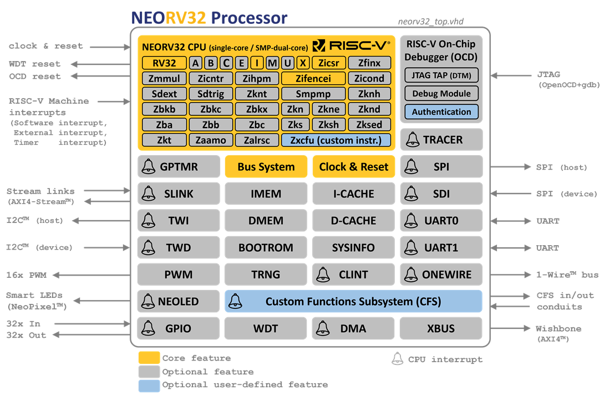

# 7 FPGA Examples


## 7.1 Hello World example

The "Hello World" design of an FPGA is normally a blinking LED, you can find such an example in the **examples\blink_led** directory. To upload this example issue the following command *(adjust -com xx for your com port)*:

```
EfinixLoader.exe -com 7 Example\blink_led\blink.hex
```
Note. The 3 LED's should now be blinking. 

<p align="center">

</p>


## 7.2 PLL Example

This is the same blinking LED example except a PLL is instantiated in the source, for this to work you need to enable the **Unified Netlist Flow** in the Efinity software (under edit project).

```
EfinixLoader.exe -com 7 Example\pll_test\pll_test.hex
```
Note. The 3 LED's should now again be blinking but this time driven by a 48MHz clock. 


## 7.3 UART bridge example

The on-board microcontroller provides an FPGA-UART to PC-UART (uart2uart) bridge. This makes it easy to connect your IP (with a UART) to the PC without requiring an external UART USB cable. 

<p align="center">

</p>

You can find an example in the **examples\uart_echo** directory. This example echos back any characters it receives from the PC and adds one. Thus if you send a character '1' the program will echo back '2'. You will need terminal program like [putty](https://www.chiark.greenend.org.uk/~sgtatham/putty/latest.html) /teraterm to communicate with the board. The single tiny push button (GPIOB_TXP04,32) is connected to reset.

```
EfinixLoader.exe -com 7 Example\uart_echo\uart_echo.hex
```

The uart2uart bridge operates with a default bitrate of 115200bps, in this example the FPGA UART uses 9600,N,8,1 so we need to adjust the baudrate of the link. We can do this with the -fpgabaudrate argument:

```
h:\GitHub\Efinix_T20_Dev_Board\EfinixLoader>EfinixLoader.exe -com 7 -fpgabaudrate 9600
```
 
<p align="center">

</p>
<p align="center">
Figure1: echo_uart example, sending '1' '4' '8'
</p>


## 7.4 Pin Toggle example

The on-board microcontroller has 17 pin connections with the Efinix FPGA. Some of these pins can be configured as input, output or special function such as UART TX/RX. The **examples\pin_level** directory contains a simple example that writes pin value (CMD input) as a string to the uart2uart bridge. The pin value and the reset are both controlled via the EfinixLoader program.

```
EfinixLoader.exe -com 7 Example\pin_level_pll\pin_level_pll.hex
```
Connect a terminal program to the second comport, use 115200,N,8,1 (any baudrate will work as we are talking to a USB UART not the FPGA UART). 

The STM32C071 pin PA15 is connected to the RESETN signal, and PC15 to the CMD input. Both pins default to input mode after power-up so to configure them as output we need to issue the following commands:

```
EfinixLoader.exe -com 7 -setdira 15 0
EfinixLoader.exe -com 7 -setdirc 15 0
```
These commands will change PA15/PC15 to 0=Output. You can now use the -setpin argument to change the pin value, for example to change the CMD pin (PC15) to 0 use:

```
EfinixLoader -com 7 -setpinc 15 0
```

To change it back to 1 use:

```
EfinixLoader -com 7 -setpinc 15 1
```

See batch file toggle_cmd.bat which toggles this pin a few times.  

Once you are done with the test it is recommended to change the port back to input(1):

```
EfinixLoader.exe -com 7 -setdira 15 1
EfinixLoader.exe -com 7 -setdirc 15 1
```

<p align="center">

</p>
<p align="center">
Figure2:pin_level_pll example 
</p>


<span style="color:red">Please note there are no current limiting resistors between the STM32C071 and the T20Q100F3, so the user is responsible to not drive both the STM32C071 pin and the T20Q100F3 pin at the same time!</span>

<span style="color:red">In addition, this board does have an extra ESD protection on the I/O pins, so the usual common sense electronic component handling is required.</span> 

## 7.5 NEORV32 RISC-V Example

Every development boards needs a RISC-V core (ideally running Doom...:-), I picked the [NEORV32](https://github.com/stnolting/neorv32) which is a great core fully documented and available in VHDL/Verilog. I selected the "neorv32_ProcessorTop_MinimalBoot" configuration and added a PLL to increase the clock from 12 to 62.67MHz. I also recompiled the NEORV32 bootloader (neorv32-main/sw/bootloader) and some of the examples to use 115200bps instead of the default 19200. The amount of effort to get this core up and running was minimal which shows the quality of this core.

<p align="center">

</p>
<p align="center">
Figure3: NEORV32 RISC-V IP core by Stephan Nolting
</p>

To load the design use:

```
EfinixLoader.exe -com 7 Example\neorv32_riscv\risc-v.hex
```

The RV32I core is configured with a single UART connected to the uart2uart bridge (115200,N,9,1). The reset pin is connected to PC15 and the PIO to the LEDs. After loading the design the terminal connected to the uart2uart bridge should show the bootloader menu, if not toggle the reset (see reset.bat file).

Once you have the bootloader you can upload a file and execute it. For this make sure you select binary option on your terminal (for example Tera Term) and disable the local echo. There are 2 example I pre-compiled, helloworld.bin and demo_blink_led.bin. Figure8 shows the helloworld.bin example output, after this excute reset.bat to get back to the bootloader menu.

<p align="center">

</p>
<p align="center">
Figure4: Teraterm running NEORV32 bootloader
</p>

## 7.5.1 RISC-V RTL Simulation

I have also created a simple batch file for Questa/Modelsim to perform rtl and gatelevel simulation. Navigate to the sim directory and execute run_questa.bat in a CMD prompt, the output should be something like:

```
# set NumericStdNoWarnings 1
# 1
#  nolog -r /*
#  run 40 ms
# ** Note: [NEORV32] Implementing processor-internal IMEM as blank RAM.
#    Time: 0 ps  Iteration: 0  Instance: /neorv32_efinix_tb/U_DUT/neorv32_inst/memory_system/neorv32_int_imem_enabled/neorv32_int_imem_inst
# ** Warning: [NEORV32] Assuming this is a simulation.
#    Time: 0 ps  Iteration: 0  Region: /neorv32_efinix_tb/U_DUT/neorv32_inst/core_complex_gen(0)/neorv32_cpu_inst/hello_neorv32
# ** Note: [NEORV32] CPU tuning options:
#    Time: 0 ps  Iteration: 0  Region: /neorv32_efinix_tb/U_DUT/neorv32_inst/core_complex_gen(0)/neorv32_cpu_inst/hello_neorv32
# ** Note: [NEORV32] CPU ISA: rv32ix_zicntr_zicsr_zifencei
#    Time: 0 ps  Iteration: 0  Region: /neorv32_efinix_tb/U_DUT/neorv32_inst/core_complex_gen(0)/neorv32_cpu_inst/hello_neorv32
# ** Note: [NEORV32] BOOT_MODE_SELECT = 0: booting via bootloader
#    Time: 0 ps  Iteration: 0  Region: /neorv32_efinix_tb/U_DUT/neorv32_inst/sanity_checks
# ** Note: [NEORV32] Processor Configuration: CPU (single-core) IMEM DMEM BOOTROM CLINT GPIO UART0 SYSINFO
#    Time: 0 ps  Iteration: 0  Region: /neorv32_efinix_tb/U_DUT/neorv32_inst/sanity_checks
# ** Note: [NEORV32] The NEORV32 RISC-V Processor (v01.11.07.09), github.com/stnolting/neorv32
#    Time: 0 ps  Iteration: 0  Region: /neorv32_efinix_tb/U_DUT/neorv32_inst/sanity_checks
# N =  1, M =  94, O = 2, DIV0 =   9, DIV1 =   2, DIV2 =   2
# Using internal feedback
# CLKIN reference clock period = 83.3340 ns (12.00 MHz)
# VCO period = 0.8865 ns (1127.99 MHz)
# PLL period = 1.7731 ns (564.00 MHz)
# CLKOUT0 period = 15.9576 ns (62.67 MHz), shift = 0.0000 ns
# CLKOUT1 period = 3.5461 ns (282.00 MHz), shift = 0.0000 ns
# CLKOUT2 period = 3.5461 ns (282.00 MHz), shift = 0.0000 ns
# Reached Lock @ 1041.67 ns
# UART0:
# UART0: NEORV32 Bootloader
# UART0:
# UART0: BLDV: Jul 12 2025
# UART0: HWV:  0x01110709
# UART0: CLK:  0x03bc37cc
# UART0: MISA: 0x40800100
# UART0: XISA: 0x80000083
# UART0: SOC:  0x0003800d
# UART0: IMEM: 0x00008000
# UART0: DMEM: 0x00008000
# UART0:
# UART0: Available CMDs:
# UART0:  h: Help
# UART0:  r: Restart
# UART0:  u: Upload via UART
# UART0:  e: Start executable
```

## 7.5.2 RISC-V Gate Level Simulation

For gatelevel you first need to compiled the Efinix primitives into a library, you can do this with the following batch file (fix the <?> path):

```
vlib Efinix
vmap Efinix Efinix
vlog -quiet -work Efinix <?>/Efinity/2025.1/sim_models/verilog/*.v
vlog -quiet -work Efinix <?>/Efinity/2025.1/pt/sim_models/verilog/*.v

```
You will now have the gatelevel primitive and the simulation primitives (like EFX_PLL_V2) in the Efinix library. The gatelevel sim (structural only) can now be executed by the run_questa_gate.bat batch file:

```
# Loading std.standard
# Loading std.textio(body)
# Loading ieee.std_logic_1164(body)
# Loading ieee.numeric_std(body)
# Loading work.neorv32_efinix_tb(struct)#1
# Loading work.neorv32_efinix(fast)
# set NumericStdNoWarnings 1
# 1
#  nolog -r /*
#  run 40 ms
# N =  1, M =  94, O = 2, DIV0 =   9, DIV1 =   2, DIV2 =   2
# Using internal feedback
# CLKIN reference clock period = 83.3340 ns (12.00 MHz)
# VCO period = 0.8865 ns (1127.99 MHz)
# PLL period = 1.7731 ns (564.00 MHz)
# CLKOUT0 period = 15.9576 ns (62.67 MHz), shift = 0.0000 ns
# CLKOUT1 period = 3.5461 ns (282.00 MHz), shift = 0.0000 ns
# CLKOUT2 period = 3.5461 ns (282.00 MHz), shift = 0.0000 ns
# Reached Lock @ 1041.67 ns
# UART0:
# UART0: NEORV32 Bootloader
# UART0:
# UART0: BLDV: Jul 12 2025
# UART0: HWV:  0x01110709
# UART0: CLK:  0x03bc37cc
..etc
```

## 7.6 PLL Clock Output example

This example shows how to direct a PLL clock output to an I/O pin using the Unified Netlist mode. The PLL generates 48MHz from a 12MHz input clock signal.

```
EfinixLoader.exe -com 7 Example\pll_clkout\pll_clkout.hex
```

<p align="center">

</p>
<p align="center">
Figure5: PLL Clock output signal
</p>


## 7.7 Efinix Sapphire core

Efinix has it own fully configurable RISC-V core based on the [award winning](https://riscv.org/blog/2018/12/risc-v-softcpu-contest-highlights/) [VexRISCV](https://github.com/SpinalHDL/VexRiscv) core. In addition to the core Efinix provide an easy to use Eclipse IDE. For this demo I selected the "lite" configuration with a single UART and the "uartEchodemo" example pre-loaded into memory (64KByte). To reduce the number of files I have stripped most of the IP files and just kept the files required to synthesise the core and to run RTL/Gatelevel sim. Re-generating the full core is easy to.

Here are some push-button synthesis results (all default values used in Efinity)

```
--------------- Resource Summary (begin) ---------------
Inputs:             4 / 163         (2.45%)
Outputs:            2 / 347         (0.58%)
Clocks:             1 / 16          (6.25%)
Logic Elements:     3046 / 19728    (15.44%)
   LE: LUTs/Adders: 2407 / 19728    (12.20%)
   LE: Registers:   1549 / 13920    (11.13%)
Memory Blocks:      134 / 204       (65.69%)
Multipliers:        0 / 36          (0.00%)
---------------- Resource Summary (end) ----------------

---------- 1. Clock Frequency Summary (begin) ----------
User target constrained clocks
      Clock Name        Period (ns)  Frequency (MHz)   Waveform             Targets
EFX_PLL_V2_inst~CLKOUT0    10.000        100.000     {0.000 5.000} {EFX_PLL_V2_inst~CLKOUT0}

Maximum possible analyzed clocks frequency
      Clock Name        Period (ns)  Frequency (MHz)     Edge
EFX_PLL_V2_inst~CLKOUT0    9.430        106.045         (R-R)
---------- Clock Frequency Summary (end) ---------------
```

**A RISC-V core with 64Kbyte of memory running at 106MHz using just 16% of the luts on a &pound;10 FPGA is quite good (07/25).**

To load the design, start Teraterm(115200,N,8,1) or any other terminal program and execute:

```
EfinixLoader.exe -com 7 Examples\Efinix_riscv\Efinix_riscv.hex
```

<p align="center">

</p>
<p align="center">
Figure6: Sapphire Uart Echo Demo
</p>


The RESETN signal is connected to the microcontroller PA15 so to reset the core change the pin PA15 to output and then toggle it low and high.

```
EfinixLoader -q -com 7 -setdira 15 0
EfinixLoader -q -com 7 -setpina 15 0
EfinixLoader -q -com 7 -setpina 15 1
```

Similar to the neorv32 example to run RTL simulation navigate to the sim directory and execute the run_questa.bat file in a CMD prompt. You will first need to compile the Efinix primitives and sim_models into a "Efinix" library as shown under the neorv32 example.

```
# Loading work.t20_top_riscv_tb(rtl)#1
# Loading Efinix.EFX_PLL_V2(fast)
# Loading work.T20_Sapphire(fast)
# set NumericStdNoWarnings 1
# 1
#  nolog -r /*
#  run -all
# N =  1, M = 100, O = 2, DIV0 =   6, DIV1 =   2, DIV2 =   2
# Using internal feedback
# CLKIN reference clock period = 83.3340 ns (12.00 MHz)
# VCO period = 0.8333 ns (1199.99 MHz)
# PLL period = 1.6667 ns (600.00 MHz)
# CLKOUT0 period = 10.0001 ns (100.00 MHz), shift = 0.0000 ns
# CLKOUT1 period = 3.3334 ns (300.00 MHz), shift = 0.0000 ns
# CLKOUT2 period = 3.3334 ns (300.00 MHz), shift = 0.0000 ns
# Reached Lock @ 625.00 ns
# UART0: ***Starting Uart Echo Demo***
# UART0: Start typing on terminal to send character...
# Break key hit
# Simulation stop requested.
#  quit -f
```

For the gatelevel execute run_questa_gate.bat.

## 7.8 Create your own design

To create your own design you need the [Efinix Efinity Place&Route](https://www.efinixinc.com/products-efinity.html) software. You need to sign-up to get a free license. I would also suggest you check out the [forum](https://forum.efinix.net/latest) which has some good advice on various issues.

## License

- All example code is licensed under the [MIT License](../MIT_License.txt).


## Notice
All other trademarks are the property of their respective owners.
