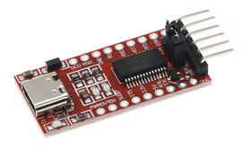
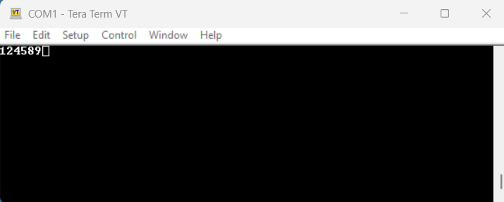
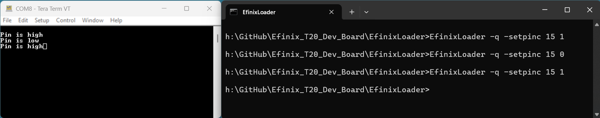
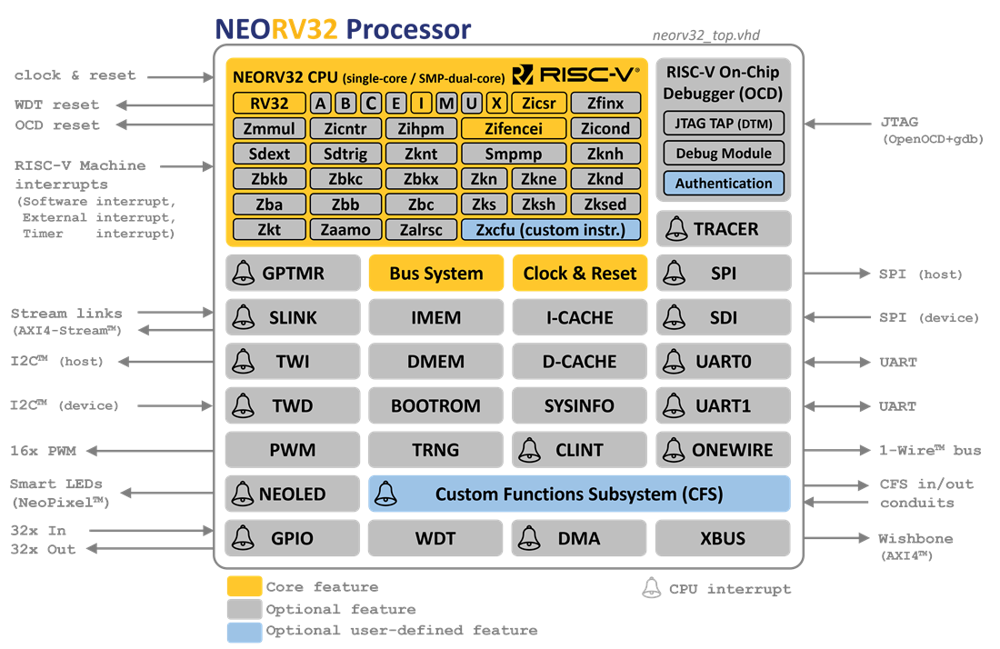
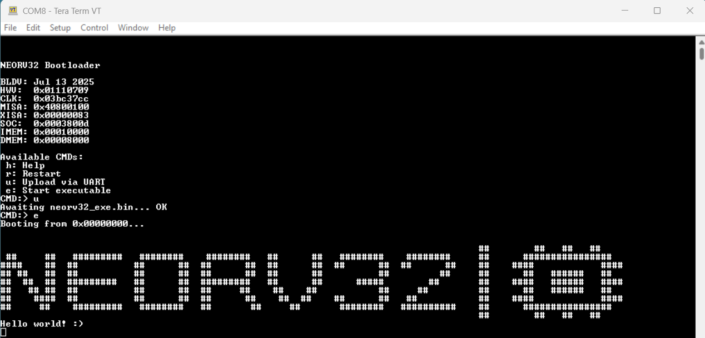

# Efinix T20Q100F3 low-cost Development Board

 
# 1. Introduction

This repository described a small low-cost Efinix T20Q100 FPGA development board. The board can be home-made or ordered fully assembled from PCBWay. The cost as of June 2025 is around [TBC] for a single board.


<p align="center">

</p>


# 2. Board Specification

- FPGA [Efinix T20Q100F3C4](https://www.efinixinc.com/shop/t20.php), 19728 Luts, 1020Kbit Memory, 36 Multipliers, 5 PLL, 16Mbit Flash
- Easy programmable and powered via USB-C, no drivers required!
- 8..48MHz clock (PLL input), optional 32KHz Clock
- 47<sup>1</sup> 3.3volt I/O pins divided over 3 IDC connectors
- 17 FPGA pins can be toggled/monitored via USB-C
- IP Core communication via USB-C (UART2UART bridge)
- *[TBC] Optional 8MByte ESP-PSRAM64H memory chip*
- On-Board tiny STM32C071 microcontroller to control the FPGA
- Small, less than credit card size (71mm x 48mm)

<sup>1</sup> 1.8volt LVDS is not supported

<p align="center">

</p>
<p align="center">
Figure1:T20Q100 Development Board 
</p>

# 3. Board Design Criteria

The Board was designed with the following requirements:

**1) On-Board Programmer**

There is nothing more annoying that purchasing a development board only to find out you need a separate dongle to program it. 

*Unfortunately this rule was broken for the on-board STM32 microcontroller which failed to program using [ST's DFU mode](https://www.st.com/resource/en/application_note/cd00264379-usb-dfu-protocol-used-in-the-stm32-bootloader-stmicroelectronics.pdf), luckily the STM32 programming dongles are very cheap.*

**2) Programmed using a plain old serial port**

Installing some special USB drivers isn't always plain sailing. The serial port, although **60 years** old is still fully supported under Linux/MACOS/Windows. A USB-C cable is all you need to program the board and communicate with your design. The serial data is routed close to error free over the USB bus and converted to SPI for the FPGA.

**3) Low-Cost and Simple**

Some of the development boards have tons of interfaces and a price to match. Sometimes you just want a simple board with a target FPGA and some I/O pins, this is one of those boards. The board contains an **Efinix T20Q100F3C4** FPGA which provides one of the best value for money FPGA you can currently buy. In addition, the FPGA comes in a "makers" friendly LQFP package and is readily available for around £8 (DigiKey). The board uses 4 layers with all the components on one side. The price different between a 2 and 4 layers was tiny but having components on both sides did increase the price. A tiny STM32C071 (less than £1 from LCSC) was added which acts as the programmer (USB to SPI bridge), clock oscillator, IP communication and soft switches.

**4) Easy communication with a PC**

The board STMC071 microcontroller can act as a USB to UART bridge and toggle/monitor FPGA pins. Thus you can program the board and communicate with your IP without requiring an external USB to TTL cable. The second UART remains active so you can communicate with e.g. your RISC-V core and toggle/monitor pins at the same time.

**5) Free tools**

The Efinix P&R tools are free and well supported. The same applies to the STM32 microcontroller, programming and configuration tools (like STM32Cube) can be downloaded for free from the ST website. The programming C source code is provided in the EfinixLoader directory and can easily be compiled by gcc/cl etc. 

**6) Expandable**

47 I/O pins of the FPGA are available on three 2.54mm IDC connectors. The power rails including the USB Vbus line are also available on one of the IDC connectors. 

**7) Assembled at home**

The board should be able to be hand-soldered. This means no 0201 components where used but you still need a microscope unless you have very good eyesight. Just watch some of the hundreds of SMD soldering tutorial on YouTube. 


# 4. How to order a fully assembled board

You can order a [fully assembled board from PCBWay](https://www.pcbway.com/project/shareproject/Efinix_T20Q100_FPGA_Development_Board_0ee8c6c9.html), this is the easiest and quickest way to get the board. The only disadvantage of ordering a fully assembled board is the minimum order quantity of 5 boards. The price [07/25] in roughly $144/£108 ($29/£22 per board), the price goes down quite quickly if you increase the order quantity. For example changing the order to 10 only increases the price to $169/£126 ($17/£13 per board) and to just $5.20/£4 if you order a 100.

Note that the purchase is directly from PCBWAY, if something goes wrong you need to contact them directly, I have no control over this process other than making the design freely available. 

<p align="center">

</p>

Also note that the fully assembled board does not yet contain the ESP-PSRAM64H and any through-hole components as this will increase the assembly cost considerably. The ESP-PSRAM64H will be added after I make sure it works OK and can be purchased with reasonable delivery charges.

Once you have received the board(s) you need to solder J5 (4 pins) and close jumper J3.

# 5. How to make your own board

Making your own board can be more cost-effective if you already have the necessary tools. The price from PCBWay [07/25] is $56/£42 for 5 boards ($11.20/£8.40 per board). The most expensive chip is the T20Q100F3 which is available from [DigiKey](https://www.digikey.com/en/products/detail/efinix-inc/T20Q100F3C4/19101258) for about $10,watch out for delivery charges. The remaining parts can be purchased for [LCSC Electronics](https://lcsc.com/) for very little money.

The Gerber files, schematics and part list are available in the PCB directory. You can zip up these files and send them to PCBWAY, JLCPCB etc for manufacturing. I would highly recommend you add a stencil when you order this board. Also if you have never used these manufacturers before they might give you first-time-buyer vouchers which makes the board even cheaper. 

<p align="center">

</p>

I assembled one of the board myself and although I did have some difficulties with dry joints and solder bridges it did work in the end. I used a hotplate and a digital microscope to assemble it.


# 6. Steps to program the on-board microcontroller

There are several ways the STM32C071 microcontroller can be programmed. The initial idea was to use the on-board STM32 DFU loader which should work via the USB-C port, unfortunately this worked on one board but failed on others. I have not been able to figure why but I suspect the loader locks on to the wrong peripheral when it sniffs for data and never reaches the USB port. 
The only method that worked consistently and reliably on all boards was to use an ST-Link/V2 programmer. Luckily you can purchase one of the programmer for just a few pounds/dollars/euros on places like eBay, Amazon, AliExpress (which I used). 

<p align="center">

</p>
<p align="center">
Figure2: Low-Cost ST-Link/V2 programmers
</p>

Note however that most of these dongles are clones and not always work perfectly with the official free STM tools. In my case the STM32Cube programmer in GUI mode did not recognised my (white, left) ST-Link/V2 programmer. Luckily the command line version worked fine, in addition STMCubeIDE build in programmer also worked fine.


<p align="center">

</p>
<p align="center">
Figure3: connecting ST-Link/V2 to J5
</p>

Here are the steps to program the STM32 microcontroller:

1) Purchase an STM32 ST-Link/V2 dongle
2) Download the free [STM32 Cube Programmer Utility](https://www.st.com/en/development-tools/stm32cubeprog.html)
3) Connect the ST-link/V2 as shown in figure 3, note a fully assembled board from PCBWay does not have any through-hole components so you need to solder the J5 connector first.
4) Open a CMD prompt, navigate to the STM32C071 directory and issue the following command:

```
STM32_Programmer_CLI -c port=swd -d stm32node01.bin 0x8000000 -v
```

The output should look something like:

```
H:\GitHub\Efinix_T20_Dev_Board\STM32C071>STM32_Programmer_CLI -c port=swd -d stm32node01.bin 0x8000000 -v
      -------------------------------------------------------------------
                       STM32CubeProgrammer v2.20.0
      -------------------------------------------------------------------

ST-LINK SN  : R
ST-LINK FW  : V2J46S7
Board       : --
Voltage     : 3.08V
SWD freq    : 4000 KHz
Connect mode: Normal
Reset mode  : Software reset
Device ID   : 0x493
Revision ID : Rev Z
Device name : STM32C07x
Flash size  : 128 KBytes
Device type : MCU
Device CPU  : Cortex-M0+
BL Version  : 0xD1

Opening and parsing file: stm32node01.bin

Memory Programming ...
  File          : stm32node01.bin
  Size          : 34.45 KB
  Address       : 0x08000000

Erasing memory corresponding to segment 0:
Erasing internal memory sectors [0 17]
Download in Progress:
██████████████████████████████████████████████████ 100%

File download complete
Time elapsed during download operation: 00:00:01.012

Verifying...

Read progress:
██████████████████████████████████████████████████ 100%

Time elapsed during verifying operation: 00:00:00.230

Download verified successfully
```

Power cycle the board and you should get 2 extra UARTs, **you are now ready to use the board **


<p align="center">

</p>
<p align="center">
Figure4: Windows device_manager showing 2 extra UART
</p>

Note the STM32 microcontroller are a popular choice for makers and hence you can find lots of resources on the internet on how to programming these devices.


# 6.1 Test we can communicate with the microcontroller

After programming the on-board microcontroller we can test the communication by using the EfinixLoader program. The EfinixLoader is a simple program which takes an FPGA bitstream file (in hex) and uploads it to the Efinix T20Q100 FPGA. 

**Navigate to the EfinixLoader directory for more information and source code for this loader.**

For a quick test you can issue the following command:

```
h:\GitHub\Efinix_T20_Dev_Board\EfinixLoader>EfinixLoader.exe -com 7 -status

***  Efinix Serial FPGA Hex loader  ***
***     Ver 0.1 (c)2025 HT-LAB      ***
***  https://github.com/htminuslab  ***

Comport            : \\.\COM7 921600,N,8,1
cdone=0 NSTATUS=1  >> Ready for Programming <<

Done.
```

This should report if communication is working.

Note that 2 UARTs are routed via the USB-C port, by default the lower UART port should be connected to the EfinixLoader, however, I am not sure this is always the case on the various OS's.
The second UART is connected to the EFINIX FPGA and can be used to communicate with a UART IP core.


# 7 FPGA Examples

## 7.1 Hello World example

The "Hello World" design of an FPGA is normally a blinking LED, you can find such an example in the **examples\blink_led** directory. To upload this example issue the following command *(adjust -com xx for your com port)*:

```
EfinixLoader.exe -com 7 Example\blink_led\blink.hex
```
Note. The 3 LED's should now be blinking. 

<p align="center">

</p>


## 7.2 PLL Example

This is the same blinking LED example except a PLL is instantiated in the source, for this to work you need to enable the **Unified Netlist Flow** in the Efinity software (under edit project).

```
EfinixLoader.exe -com 7 Example\pll_test\pll_test.hex
```
Note. The 3 LED's should now again be blinking but this time driven by a 48MHz clock. 


## 7.3 UART bridge example

The on-board microcontroller provides an FPGA-UART to PC-UART (uart2uart) bridge. This makes it easy to connect your IP (with a UART) to the PC without requiring an external UART USB cable. 

<p align="center">

</p>

You can find an example in the **examples\uart_echo** directory. This example echos back any characters it receives from the PC and adds one. Thus if you send a character '1' the program will echo back '2'. You will need terminal program like [putty](https://www.chiark.greenend.org.uk/~sgtatham/putty/latest.html) /teraterm to communicate with the board. The single tiny push button (GPIOB_TXP04,32) is connected to reset.

```
EfinixLoader.exe -com 7 Example\uart_echo\uart_echo.hex
```

The uart2uart bridge operates with a default bitrate of 115200bps, in this example the FPGA UART uses 9600,N,8,1 so we need to adjust the baudrate of the link. We can do this with the -fpgabaudrate argument:

```
h:\GitHub\Efinix_T20_Dev_Board\EfinixLoader>EfinixLoader.exe -com 7 -fpgabaudrate 9600
```
 
<p align="center">

</p>
<p align="center">
Figure5: echo_uart example, sending '1' '4' '8'
</p>


## 7.4 Pin Toggle example

The on-board microcontroller has 17 pin connections with the Efinix FPGA. Some of these pins can be configured as input, output or special function such as UART TX/RX. The **examples\pin_level** directory contains a simple example that writes pin value (CMD input) as a string to the uart2uart bridge. The pin value and the reset are both controlled via the EfinixLoader program.

```
EfinixLoader.exe -com 7 Example\pin_level_pll\pin_level_pll.hex
```
Connect a terminal program to the second comport, use 115200,N,8,1 (any baudrate will work as we are talking to a USB UART not the FPGA UART). 

The STM32C071 pin PA15 is connected to the RESETN signal, and PC15 to the CMD input. Both pins default to input mode after power-up so to configure them as output we need to issue the following commands:

```
EfinixLoader.exe -com 7 -setdira 15 0
EfinixLoader.exe -com 7 -setdirc 15 0
```
These commands will change PA15/PC15 to 0=Output. You can now use the -setpin argument to change the pin value, for example to change the CMD pin (PC15) to 0 use:

```
EfinixLoader -com 7 -setpinc 15 0
```

To change it back to 1 use:

```
EfinixLoader -com 7 -setpinc 15 1
```

See batch file toggle_cmd.bat which toggles this pin a few times.  

Once you are done with the test it is recommended to change the port back to input(1):

```
EfinixLoader.exe -com 7 -setdira 15 1
EfinixLoader.exe -com 7 -setdirc 15 1
```

<p align="center">

</p>
<p align="center">
Figure6:pin_level_pll example 
</p>


<span style="color:red">Please note there are no current limiting resistors between the STM32C071 and the T20Q100F3, so the user is responsible to not drive both the STM32C071 pin and the T20Q100F3 pin at the same time!</span>

<span style="color:red">In addition, this board does have an extra ESD protection on the I/O pins, so the usual common sense is required.</span> 

## 7.5 RISC-V Example

Every development boards needs a RISC-V core (ideally running Doom...:-), I picked the [NEORV32](https://github.com/stnolting/neorv32) which is a great core fully documented and available in VHDL/Verilog. I selected the "neorv32_ProcessorTop_MinimalBoot" configuration and added a PLL to increase the clock from 12 to 62.67MHz. I also recompiled the NEORV32 bootloader (neorv32-main/sw/bootloader) and some of the examples to use 115200bps instead of the default 19200. The amount of effort to get this core up and running was minimal which shows the quality of this core.

<p align="center">

</p>
<p align="center">
Figure7: NEORV32 RISC-V IP core by Stephan Nolting
</p>

To load the design use:

```
EfinixLoader.exe -com 7 Example\risc-v\risc-v.hex
```

The RV32I core is configured with a single UART connected to the uart2uart bridge (115200,N,9,1). The reset pin is connected to PC15 and the PIO to the LEDs. After loading the design the terminal connected to the uart2uart bridge should show the bootloader menu, if not toggle the reset (see reset.bat file).

Once you have the bootloader you can upload a file and execute it. For this make sure you select binary option on your terminal (for example Tera Term) and disable the local echo. There are 2 example I pre-compiled, helloworld.bin and demo_blink_led.bin. Figure8 shows the helloworld.bin example output, after this excute reset.bat to get back to the bootloader menu.

<p align="center">

</p>
<p align="center">
Figure8: Teraterm running NEORV32 bootloader
</p>

## 7.5.1 RISC-V RTL Simulation

I have also created a simple batch file for Questa/Modelsim to perform rtl and gatelevel simulation. Navigate to the sim directory and execute run_questa.bat in a CMD prompt, the output should be something like:

```
# set NumericStdNoWarnings 1
# 1
#  nolog -r /*
#  run 40 ms
# ** Note: [NEORV32] Implementing processor-internal IMEM as blank RAM.
#    Time: 0 ps  Iteration: 0  Instance: /neorv32_efinix_tb/U_DUT/neorv32_inst/memory_system/neorv32_int_imem_enabled/neorv32_int_imem_inst
# ** Warning: [NEORV32] Assuming this is a simulation.
#    Time: 0 ps  Iteration: 0  Region: /neorv32_efinix_tb/U_DUT/neorv32_inst/core_complex_gen(0)/neorv32_cpu_inst/hello_neorv32
# ** Note: [NEORV32] CPU tuning options:
#    Time: 0 ps  Iteration: 0  Region: /neorv32_efinix_tb/U_DUT/neorv32_inst/core_complex_gen(0)/neorv32_cpu_inst/hello_neorv32
# ** Note: [NEORV32] CPU ISA: rv32ix_zicntr_zicsr_zifencei
#    Time: 0 ps  Iteration: 0  Region: /neorv32_efinix_tb/U_DUT/neorv32_inst/core_complex_gen(0)/neorv32_cpu_inst/hello_neorv32
# ** Note: [NEORV32] BOOT_MODE_SELECT = 0: booting via bootloader
#    Time: 0 ps  Iteration: 0  Region: /neorv32_efinix_tb/U_DUT/neorv32_inst/sanity_checks
# ** Note: [NEORV32] Processor Configuration: CPU (single-core) IMEM DMEM BOOTROM CLINT GPIO UART0 SYSINFO
#    Time: 0 ps  Iteration: 0  Region: /neorv32_efinix_tb/U_DUT/neorv32_inst/sanity_checks
# ** Note: [NEORV32] The NEORV32 RISC-V Processor (v01.11.07.09), github.com/stnolting/neorv32
#    Time: 0 ps  Iteration: 0  Region: /neorv32_efinix_tb/U_DUT/neorv32_inst/sanity_checks
# N =  1, M =  94, O = 2, DIV0 =   9, DIV1 =   2, DIV2 =   2
# Using internal feedback
# CLKIN reference clock period = 83.3340 ns (12.00 MHz)
# VCO period = 0.8865 ns (1127.99 MHz)
# PLL period = 1.7731 ns (564.00 MHz)
# CLKOUT0 period = 15.9576 ns (62.67 MHz), shift = 0.0000 ns
# CLKOUT1 period = 3.5461 ns (282.00 MHz), shift = 0.0000 ns
# CLKOUT2 period = 3.5461 ns (282.00 MHz), shift = 0.0000 ns
# Reached Lock @ 1041.67 ns
# UART0:
# UART0: NEORV32 Bootloader
# UART0:
# UART0: BLDV: Jul 12 2025
# UART0: HWV:  0x01110709
# UART0: CLK:  0x03bc37cc
# UART0: MISA: 0x40800100
# UART0: XISA: 0x80000083
# UART0: SOC:  0x0003800d
# UART0: IMEM: 0x00008000
# UART0: DMEM: 0x00008000
# UART0:
# UART0: Available CMDs:
# UART0:  h: Help
# UART0:  r: Restart
# UART0:  u: Upload via UART
# UART0:  e: Start executable
```

## 7.5.2 RISC-V Gate Level Simulation

For gatelevel you first need to compiled the Efinix primitives into a library, you can do this with the following batch file (fix the <?> path):

```
vlib Efinix
vmap Efinix Efinix
vlog -quiet -work Efinix <?>/Efinity/2025.1/sim_models/verilog/*.v
vlog -quiet -work Efinix <?>/Efinity/2025.1/pt/sim_models/verilog/*.v

```
You will now have the gatelevel primitive and the simulation primitives (like EFX_PLL_V2) in the Efinix library. The gatelevel sim (structural only) can now be executed by the run_questa_gate.bat batch file:

```
# Loading std.standard
# Loading std.textio(body)
# Loading ieee.std_logic_1164(body)
# Loading ieee.numeric_std(body)
# Loading work.neorv32_efinix_tb(struct)#1
# Loading work.neorv32_efinix(fast)
# set NumericStdNoWarnings 1
# 1
#  nolog -r /*
#  run 40 ms
# N =  1, M =  94, O = 2, DIV0 =   9, DIV1 =   2, DIV2 =   2
# Using internal feedback
# CLKIN reference clock period = 83.3340 ns (12.00 MHz)
# VCO period = 0.8865 ns (1127.99 MHz)
# PLL period = 1.7731 ns (564.00 MHz)
# CLKOUT0 period = 15.9576 ns (62.67 MHz), shift = 0.0000 ns
# CLKOUT1 period = 3.5461 ns (282.00 MHz), shift = 0.0000 ns
# CLKOUT2 period = 3.5461 ns (282.00 MHz), shift = 0.0000 ns
# Reached Lock @ 1041.67 ns
# UART0:
# UART0: NEORV32 Bootloader
# UART0:
# UART0: BLDV: Jul 12 2025
# UART0: HWV:  0x01110709
# UART0: CLK:  0x03bc37cc
..etc
```

## 7.6 Create your own design

To create your own design you need the [Efinix Efinity Place&Route](https://www.efinixinc.com/products-efinity.html) software. You need to sign-up to get a free license. I would also suggest you check out the forum which has some good advice on various issues.


# 8 Board Specifications

The schematics, parts list and PCB gerber files can be found in the PCB directory.

## 8.1 Clock Sources

The T20Q100 development board does not have an external oscillator, instead the STM32C071 is used to generate the FPGA clock. This not only keeps the cost down but also provide a more flexible clock generation solution as the STMC071 can generate a range of frequencies from 1MHz to 48MHz. A T20Q100 PLL can then be used to further adjust the frequency.

<p align="center">

</p>
</p>
<p align="center">
Figure9: Clock Sources
</p>

The generated clock out of the STM32C071 is routed to pin 7 and pin 54 of the T20Q100 FPGA. In the schematics the clock is labelled as CLK48M, however, a default value of 12MHz is used which is within the spec of the T20Q100 PLL (GPIOR_157_PLLIN) and is a more power efficient than routing 48MHz across the board.  However since the minimum PLL in clock frequency is 10MHz the clock is also routed to a standard (non-PLL) input (CLK0, pin 7).

A second clock of 32KHz is available but not yet implemented. The 32KHz clock has a 5% tolerance (before calibration) compare to 1% for the 12MHz clock. You can easily use the 12MHz clock to generate a more accurate 32KHz clock and the power consumption difference is minimal. For these reasons I have programmed the pin as a general I/O but feel free to convince me otherwise.
 

See **examples\pll_test** for a unified flow example. Note that the current Efinity 2025.1.110 version does seems to have some gremlins when it comes to the PLL. I have observed some strange behaviour where the PLL was not recognised in the source until I added the SDC file. If you hit any issues post it on the Efinix Mailing list, there some good Efinix AE's on that list.

## 8.2 LEDs

The T20Q100 development board has 5 LED's, 1 red LED is used for Power, 1 blue LED is connected to the STM32C071 controller and the remaining 3 LED's can be controller by the T20Q100 (pin GPIOB_TXP01, GPIOB_TXN04 and GPIOB_TXP07). Apart from the power LED and other LED's are off by default.  The 3 FPGA LED's are all used in the blink_led example example. The STM32 blue LED connected to the STM32C071 port PB4. You can turn it on and off using the Efinixloader (Windows Batch file example):

```
@REM STM32 Blue Led on
EfinixLoader.exe -com 7 -setpinb 4 0
@REM STM32 Blue Led off
EfinixLoader.exe -com 7 -setpinb 4 1
```

This STM32C071 blue led is used for debugging and if turned on something has gone wrong on the STM32C071 code.

## 8.3 Push Button

The T20Q100 Development board has a tiny single push button connected to GPIOB_TXP04(32) pin, the push action results in an active low signal (default pull-up). When using this push button a debounce circuit might be required. In my opinion it is easier to use the STM32C071 to drive a pin than to use this tiny push button.


## 8.4 STM32 T20Q100 parallel pin connections

The STM32C071 has a total of 17 parallel pin connections with the T20Q100. These pins can be input or output. See pin_toggle example. Note development is in progress to make the pin assignment more flexible.

## 8.5 Power consumption

The board has a 500mA 3.3volt and a 300mA 1.2 volt linear regulator. In passive mode waiting to be programmed the whole board consumes around 76mW, when the RISC-V core is running at 67MHz with 1 LED toggling the power increases to about 268mW. 

# 9. FAQ

## 9.1 Do you provide the source code for the STM32C071?
Not yet, however, using STM32CubeIDE it shouldn't be too difficult to write your own code.

## 9.2 Can you change the on-board controller to do XYZ?
Perhaps, just log an enhancement request on GitHub and I will have a look.

## 9.3 Do you know a reliable source for the PSRAM memory?
No, but I have ordered some from AliExpress and will update this page what I find out.

# 10. Errata

- Some of the decoupling capacitor labels are missing around U3, see correction in PCB\silkscreen.pdf
- Missing pull-up on SPI_CS_N, this is only minor as the pin is connected to GPIOL_46 which has a weak pull-up.


# 11. New Revision

If you are planning to make your own board based on this design I would recommend the following: 
- Fix the issue as described under the above errata section
- Add missing pin1 indicator to J5
- Add 2.54mm test pin to the USART RX (PB7) of the STM32C071
- Connect SPI_CS_N to one of the microcontroller pins
- The D2(SP0503BAHT) ESD protection diode might be redundant given the large number of exposed pins without protection.


## License

- 🧠 **Software code** is licensed under the [MIT License](./MIT_License.txt).
- 🛠 **Design files** (Board Design, schematics, etc.) is licensed under the [Creative Commons License](./CC_License.txt)


## Notice
All other trademarks are the property of their respective owners.
