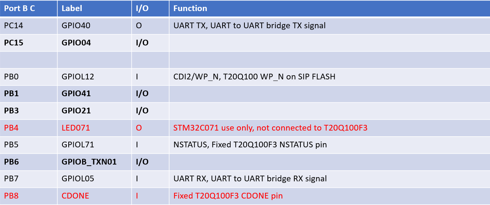

# T20Q100 Development Board STM32C071

# 1. Introduction

The on-Board STM32C071 microcontroller performs a number of tasks on the T20Q100F3 development, these are:

- Implement dual USB-C UART interfaces
- Implement a UART-2-SPI bridge to program the T20Q100F3
- Implement a UART-2-UART bridge to allow an IP core to communicate with a PC
- Generate a master clock signal, 1 to 48MHz max
- Optionally generate a secondary 32KHz clock signal
- Provide digital I/O signals to the T20Q100F3

Note the STM32 source code is not yet provided.

# 2. Pin Assignments

The STM32C071 has a number of connections to the T20Q100F3 FPGA which can be configured as an input or output. These connections can be used to control pins on the FPGA for functions like reset.

Please note there are no current limiting resistors between the STM32C071 and the T20Q100F3, so the user is responsible to not drive both the STM32C071 pin and the T20Q100F3 pin at the same time!

Figure 1 and 2 shows the pin-out of the STM32C071. The signals in red are fixed and cannot or should not be changed. 

figure 1: Port A pin-out

figure 1: Port B and C pin-out

Most of the pins are defaulting to input after power-up.

# 3. Develop your own STM32 code

Development for the STM32C071 (and other STM32 microcontroller) is very easy to do due to the excellent free development tools provided by STMicroelectronics. You can configure the STM32C071 peripherals graphically and there is a large HAL library available which allows you to use high-level generics calls to use and further configure the peripherals. 

If you want to develop your own code you need:

- The [free STMCubeIDE](https://www.st.com/en/development-tools/stm32cubeide.html), this provide all the tools to program/configure the STM32C071
- The [free STM32CubProg](https://www.st.com/en/development-tools/stm32cubeprog.html) programming utility
- ST-Link/V2 programming dongle

There is also a [Visual Studio Code plug-in](https://www.st.com/en/development-tools/stm32vscode.html) for users that prefer that environment.  

## License

TBC

## Notice
All other trademarks are the property of their respective owners.
